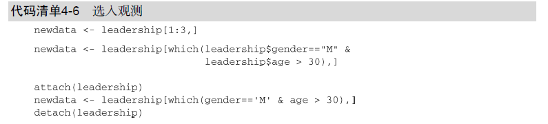

# 选入观测、行



```javascript
#  Selecting Observations
newdata <- leadership[1:3, ]

newdata <- leadership[which(leadership$gender == "M" &
    leadership$age > 30), ]

```

```javascript
leadership$date <- as.Date(leadership$date, "%m/%d/%y")
startdate <- as.Date("2009-01-01")
enddate <- as.Date("2009-10-31")
newdata <- leadership[leadership$date >= startdate &
    leadership$date <= enddate, ]

```
