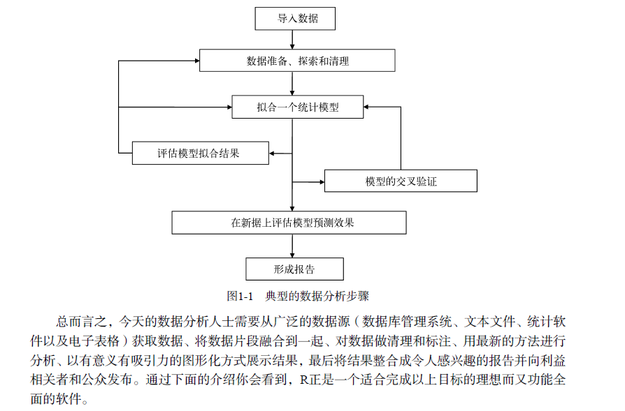
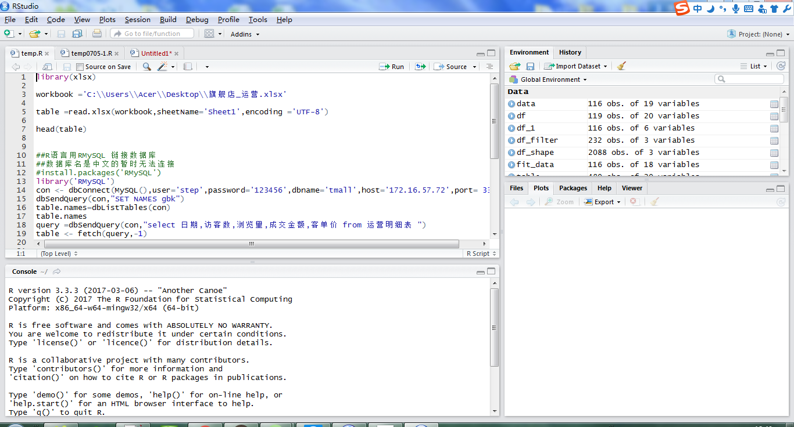

# R语言介绍



## R安装
CRAN [he R Project for Statistical Computing](https://www.r-project.org/)

## R编辑器

[Rstuido](https://www.rstudio.com/)
* 编辑器界面如下


## R的使用

```javascript
setwd("C:/R/R in Action")#设置工作目录
options(digits=3)#设置小数位
install.packages("dplyr") #安装包
help(package = "dplyr")  # 包doc帮助文档
library("dplyr") #加载包
patientID <- c(1, 2, 3, 4)
age <- c(25, 34, 28, 52)
diabetes <- c("Type1", "Type2", "Type1", "Type1")
status <- c("Poor", "Improved", "Excellent", "Poor")
patientdata <- data.frame(patientID, age, diabetes,
    status)
patientdata
```
