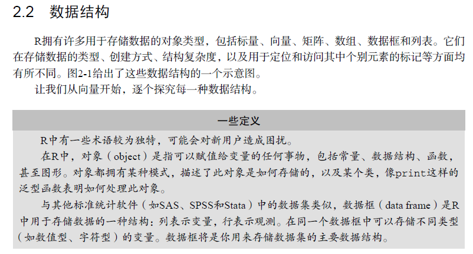
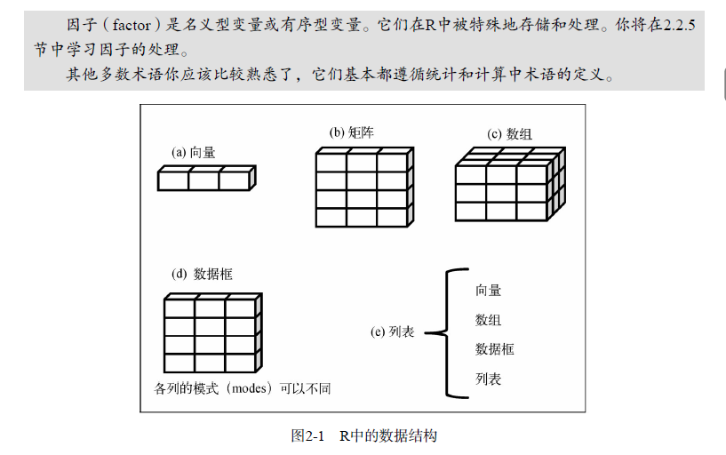
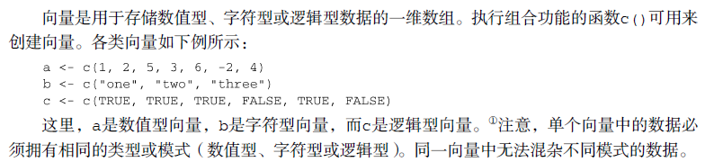
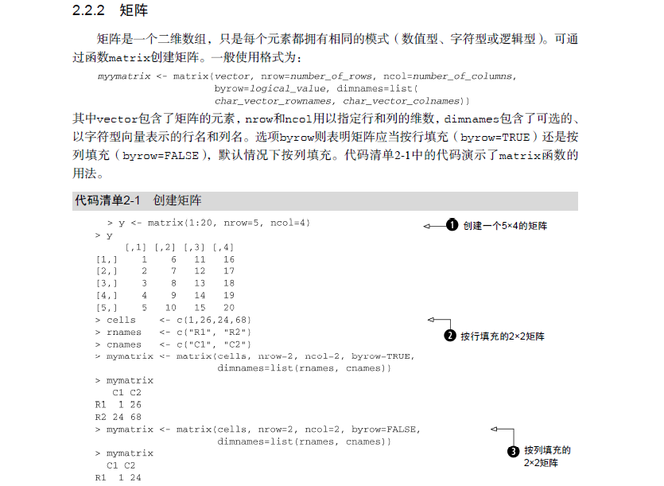
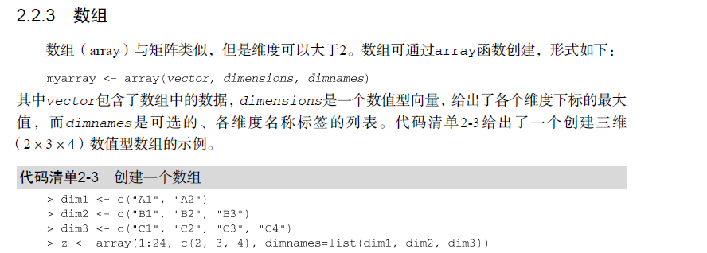
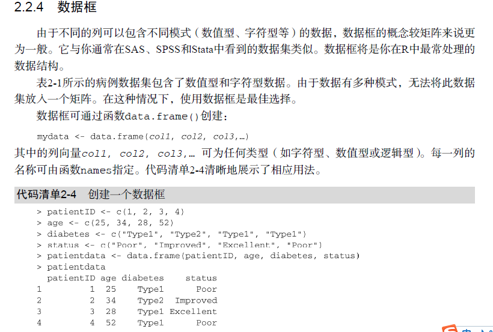
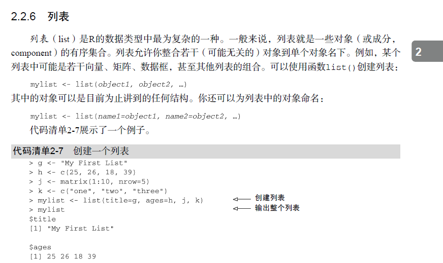
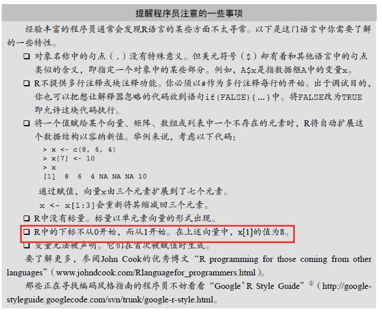

## 向量


* 单个向量中的数据必须拥有相同的类型或模式（数值型、字符型或逻辑型）。同一向量中无法混杂不同模式的数据。

* 方位向量中的元素 叫做 切片，也可以叫做查询；
```javascript
a <- c(1, 2, 5, 3, 6, -2, 4)
a[3]
a[c(1, 3, 5)]
a[2:6]

```
## 矩阵



* 矩阵是一个二维数组，只是每个元素都拥有相同的模式（数值型、字符型或逻辑型）
```javascript
# Listing 2.1 - Creating Matrices

y <- matrix(1:20, nrow = 5, ncol = 4)
y
cells <- c(1, 26, 24, 68)
rnames <- c("R1", "R2")
cnames <- c("C1", "C2")
mymatrix <- matrix(cells, nrow = 2, ncol = 2, byrow = TRUE,
    dimnames = list(rnames, cnames))
mymatrix
mymatrix <- matrix(cells, nrow = 2, ncol = 2, byrow = FALSE,
    dimnames = list(rnames, cnames))
mymatrix

# Listing 2.2 - Using matrix subscripts

x <- matrix(1:10, nrow = 2)
x
x[2, ]
x[, 2]
x[1, 4]
x[1, c(4, 5)]

```


## 数组

```javascript
# Creating an array

dim1 <- c("A1", "A2")
dim2 <- c("B1", "B2", "B3")
dim3 <- c("C1", "C2", "C3", "C4")
z <- array(1:24, c(2, 3, 4), dimnames = list(dim1,
    dim2, dim3))
z

```


## 数据框


* 每一列数据的模式必须唯一，不过你却可以将多个模式的不同列放到一起组成数据框。
* 讨论数据框时将交替使用术语列和变量。
```python
patientID <- c(1, 2, 3, 4)
age <- c(25, 34, 28, 52)
diabetes <- c("Type1", "Type2", "Type1", "Type1")
status <- c("Poor", "Improved", "Excellent", "Poor")
patientdata <- data.frame(patientID, age, diabetes,
    status)
patientdata
# Specifying elements of a dataframe
patientdata[1:2]
patientdata[c("diabetes", "status")]
patientdata$age


```


## 列表

```javascript
#  Creating a list

g <- "My First List"
h <- c(25, 26, 18, 39)
j <- matrix(1:10, nrow = 5)
k <- c("one", "two", "three")
mylist <- list(title = g, ages = h, j, k)
mylist

```

## 小结
* 数据结构主要掌握两个核心；
1. 如何创建数据结构，数据结构的特征特点；
2. 如何对数据结构切片操作，或者说：查询其中的子元素，换个说法如何取值；



