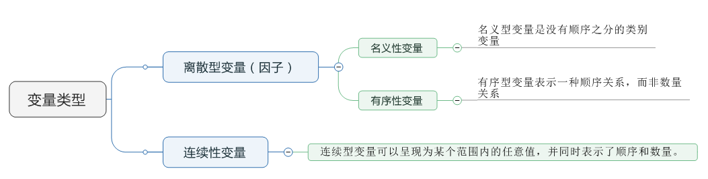
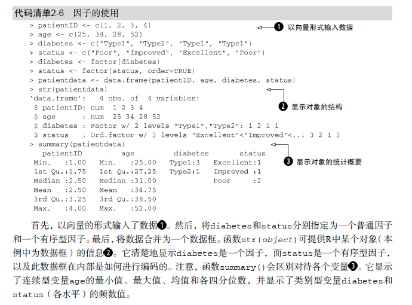
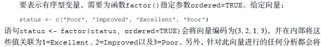
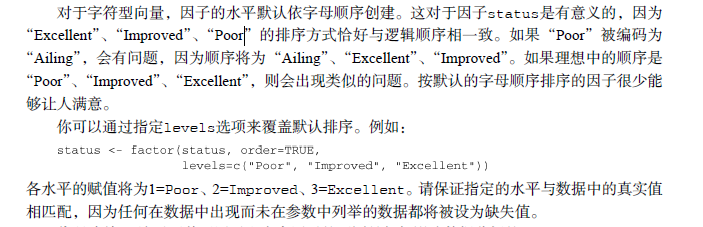

# 变量类型




```javascript
# Listing  - Using factors

patientID <- c(1, 2, 3, 4)
age <- c(25, 34, 28, 52)
diabetes <- c("Type1", "Type2", "Type1", "Type1")
status <- c("Poor", "Improved", "Excellent", "Poor")
diabetes <- factor(diabetes,order=False)
status <- factor(status, order = TRUE)
patientdata <- data.frame(patientID, age, diabetes,
    status)
str(patientdata)
summary(patientdata)

```




## 分类变量
分类变量，有时候也被称为名义变量，一般指两个及以上的分类，但是本身没有等级顺序之分，属于离散值，通常是字符型值，但也可用数值代表，其具体数值没有加减乘除的意义，不能用来计算而只能用来分类或者计数。名义变量比如性别、省份、职业，有序变量比如班级名次。

因为离散变量有各种不同表示方法，在S中为统一起见使用因子(factor)来表示这种分类变量。
因子是一种特殊的字符型向量，其中每一个元素取一组离散值中的一个，而因子对象有一个特殊属性levels表示这组离散值（用字符串表示）。例如：

```javascript
> x <- c("男", "女", "男", "男"， "女")
> y <- factor(x)
> y
[1] 男 女 男 男 女
Levels:  男 女
```

## 有序变量（Ordinal Variable）

类别之间存在序次关系的变量。重点是有顺序；
病情Status（poor, improved, excellent）是顺序型变量的一个上佳示例。病情为poor（较差）病人的状态不如improved（病情好转）的病人，但并不知道相差多少


## 因子
类别（名义型）变量和有序类别（有序型）变量在R中称为因子（factor）
