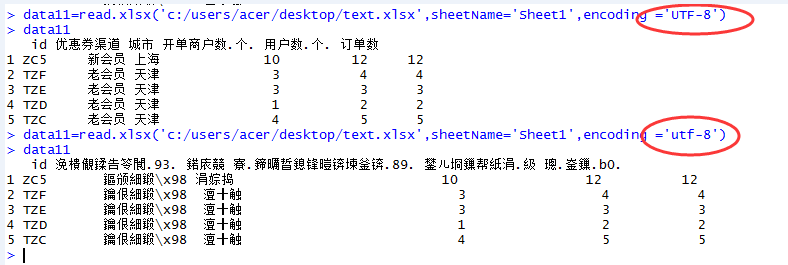

# excel输入输出

把excel文件直接读入R语言


```javascript
library(xlsx)

workbook ='C:\\Users\\Acer\\Desktop\\旗舰店_运营.xlsx'

table =read.xlsx(workbook,sheetName='Sheet1',encoding ='UTF-8')

head(table)

```

把excel文件直接读入R语言
1 在 http://www.java.com/zh_CN/download/manual.jsp 下载合适自己电脑的JAVA程序并安装；
 可以打开我们亲爱的R了
 ```javascript
 install.packages("rJava")

install.packages("xlsxjars")#安装xlsx的前提

install.packages("xlsx")

library("xlsx")
#读取Excel文件
data<-read.xlsx("d:/temp/data.xlsx",1,encoding='UTF-8')
#注意encoding='UTF-8'这个参数，如果没有该参数或该参数设置不正确，##从Excel中读取的中文字符为乱码
 ```
 参考：
 [把excel文件直接读入R语言](https://d.cosx.org/d/132031-132031)
