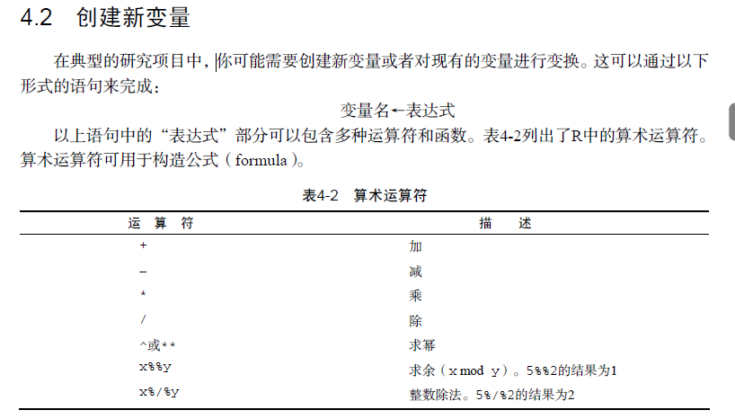

# 数据预处理

## 创建新变量


```javascript
anager <- c(1, 2, 3, 4, 5)
date <- c("10/24/08", "10/28/08", "10/1/08", "10/12/08",
    "5/1/09")
gender <- c("M", "F", "F", "M", "F")
age <- c(32, 45, 25, 39, 99)
q1 <- c(5, 3, 3, 3, 2)
q2 <- c(4, 5, 5, 3, 2)
q3 <- c(5, 2, 5, 4, 1)
q4 <- c(5, 5, 5, NA, 2)
q5 <- c(5, 5, 2, NA, 1)
leadership <- data.frame(manager, date, gender, age,
    q1, q2, q3, q4, q5, stringsAsFactors = FALSE)

#创建新变量
mydata <- data.frame(x1 = c(2, 2, 6, 4), x2 = c(3,
    4, 2, 8))
mydata$sumx <- mydata$x1 + mydata$x2
mydata$meanx <- (mydata$x1 + mydata$x2)/2
```
