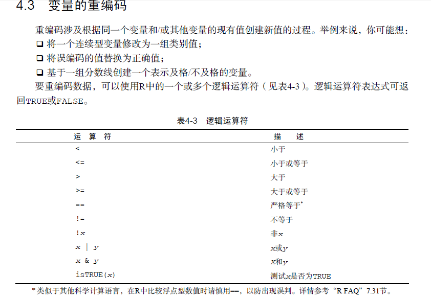

# 变量的重编码



```javascript
leadership$agecat[leadership$age > 75] <- "Elder"
leadership$agecat[leadership$age > 45 &
    leadership$age <= 75] <- "Middle Aged"
leadership$agecat[leadership$age <= 45] <- "Young"
```
