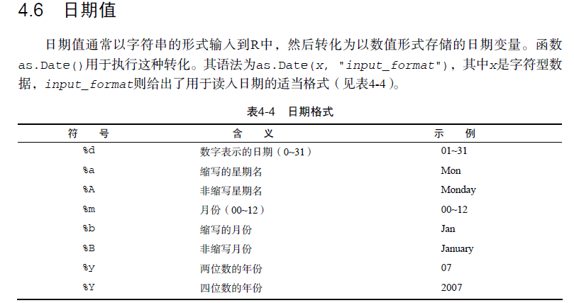
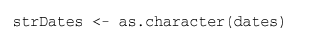
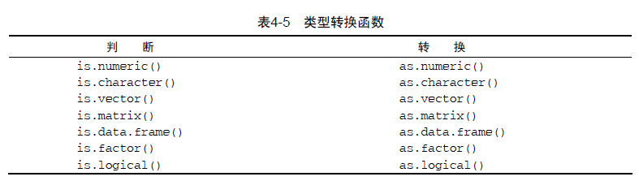

# 数据转换

##  日期值


```javascript
mydates <- as.Date(c("2007-06-22", "2004-02-13"))

# Converting character values to dates

strDates <- c("01/05/1965", "08/16/1975")
dates <- as.Date(strDates, "%m/%d/%Y")

myformat <- "%m/%d/%y"
leadership$date <- as.Date(leadership$date, myformat)


```

## 将日期转换为字符型变量


## 类型转换


