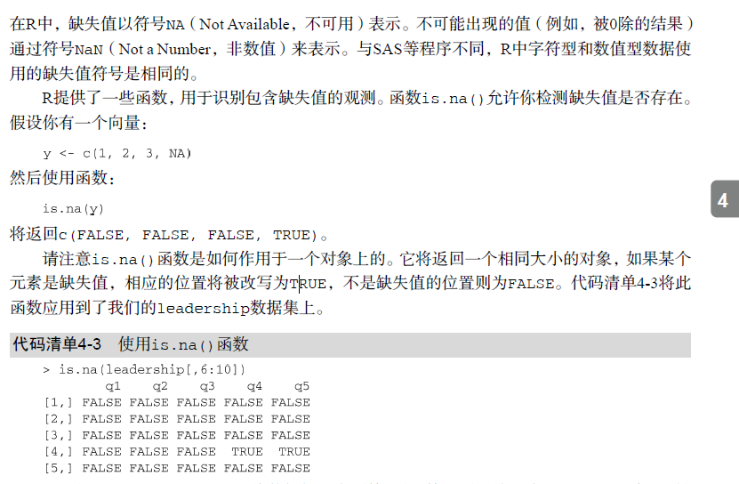

# 缺失值处理

## R中缺失值符号




## 重编码某些值为缺失值
* 使用赋值语句将某些值重编码为缺失值
```javascript
# recode 99 to missing for the variable age
leadership[leadership$age == 99, "age"] <- NA
leadership
```
## 在分析中排除缺失值
* na.omit()移除所有含有缺失值的观测;
```javascript
# Using na.omit() to delete incomplete observations
newdata <- na.omit(leadership)
newdata
```
